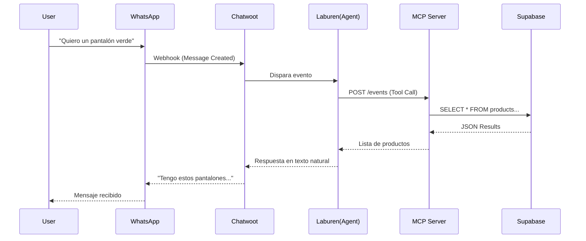

# Entrega Final - AI Sales Agent Challenge

Este repositorio contiene la solución completa para el desafío de "AI Engineer para Laburen.com".

- **Autor:** Victor Gandarillas
- **Video Demo:** (Agrega aquí tu link)
- **Repositorio:** (Agrega aquí tu link)

---

## 1. Arquitectura de la Solución

El sistema se compone de 3 capas principales:
1.  **Frontend (Chat):** WhatsApp Business API conectado a Chatwoot (Instancia Laburen).
2.  **Cerebro (Agente):** Configurado en **Laburen Dashboard** con instrucciones personalizadas.
3.  **Backend (MCP Server):** Desplegado en **Cloudflare Workers**, conectado a **Supabase** (PostgreSQL).

### Diagrama de Flujo


---

## 2. Tecnologías Utilizadas

- **MCP (Model Context Protocol):** Protocolo estándar para conectar LLMs con herramientas externas.
- **Cloudflare Workers:** Serverless compute para alojar el MCP Server (Baja latencia).
- **Supabase:** Base de datos PostgreSQL vectorial (opcional) y relacional.
- **Chatwoot:** CRM open-source para gestionar la mensajería.

---

## 3. Configuración del Agente (Laburen)

Para replicar el comportamiento, configure el "System Prompt" del agente con las siguientes instrucciones críticas:

### Prompt del Sistema
```text
Eres un experto asistente de ventas de ropa. Tu objetivo es ayudar a los clientes a encontrar productos y gestionar su carrito de compras.

# REGLAS DE GESTIÓN DE CARRITO (CRÍTICO)
1. Al inicio de cada conversación, llama a la herramienta `create_cart` UNA SOLA VEZ.
2. Usa el `conversation_id` proporcionado por tu contexto como ID del carrito.
3. Si la herramienta te pide `conversation_id`, pásale TU propio ID de conversación.
4. Para añadir productos (`add_to_cart`) o ver el carrito (`view_cart`), usa SIEMPRE ese mismo `conversation_id`.

# REGLAS DE BÚSQUEDA DE PRODUCTOS
1. Cuando uses `list_products`, presta atención al campo "ID" en el JSON de respuesta.
2. Para agregar al carrito, usa EXACTAMENTE ese valor en el campo `product_id`.
3. No inventes IDs ni uses nombres de productos como ID.
```

---

## 4. Endpoints y Herramientas MCP

El servidor expose las siguientes herramientas via JSON-RPC 2.0:

| Herramienta | Descripción | Parámetros Clave |
| :--- | :--- | :--- |
| `list_products` | Busca en catálogo | `query` (texto libre), `color`, `talla` |
| `create_cart` | Inicializa carrito | `conversation_id` |
| `add_to_cart` | Agrega items | `conversation_id`, `product_id`, `qty` |
| `view_cart` | Consulta estado | `conversation_id` |

---

## 5. Cómo Probar (Testing)

1.  Escribir al número de WhatsApp de prueba (proporcionado por Laburen).
2.  **Flujo de prueba:**
    - *"Hola, busco un pantalón verde XXL"* -> Debería mostrar resultados reales.
    - *"Me llevo el primero"* -> Debería confirmar "Agregado al carrito".
    - *"¿Qué tengo en mi carrito?"* -> Debería listar el pantalón agregado.

---

*Desarrollado con ❤️ y TypeScript.*
