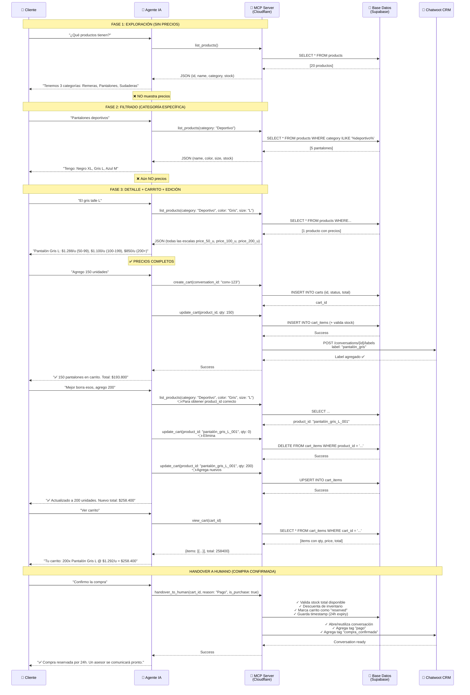

# 🛒 Flujo de Interacción - Agente de IA Laburen

**Documento Conceptual - Máx 2 Páginas**

Este documento detalla cómo el agente de IA atiende a un cliente a través de:
1. Exploración de productos
2. Creación de carrito
3. Edición de carrito (incluye eliminación)
4. Derivación a humano para compra

---

## 📊 Diagrama de Secuencia (Flujo Principal)



---

## 🛠️ Endpoints MCP (Tools)

| Herramienta | Parámetros | Descripción | Cuándo se usa |
|:---|:---|:---|:---|
| **list_products** | `name?`, `category?`, `color?`, `size?` | Busca productos con filtros opcionales. Devuelve id, nombre, descripción, precios (3 escalas), stock | Exploración (Fase 1 y 2), Filtrado (Fase 2), Detalle (Fase 3), Verificación product_id antes de modificar |
| **create_cart** | `conversation_id?` | Crea nuevo carrito o reutiliza existente por conversación | Una vez por conversación, al primer "add to cart" |
| **view_cart** | `cart_id` | Devuelve items + total actualizado | Usuario pregunta "¿Cómo quedó?" o "Ver carrito" |
| **update_cart** | `cart_id`, `product_id`, `qty` | Agrega/modifica cantidades. Si qty=0, elimina. Valida stock. Agrega label a Chatwoot | Agregar productos, cambiar cantidades, eliminar items |
| **clear_cart** | `cart_id` | Vacía TODO el carrito de una vez | Usuario dice "Borrar todo" o "Reiniciar pedido" |
| **handover_to_human** | `cart_id`, `reason`, `is_purchase` | Deriva a Chatwoot. Si is_purchase=true: valida stock + descuenta + reserva 24h. Si false: consulta sin afectar stock | Compra confirmada (is_purchase=true) o consultas/cambios (is_purchase=false) |

---

## 📍 Punto Clave: Flujo de Edición de Carrito

### Eliminación Correcta
```
User: "Borra esos 150"
    ↓
Agent: 
    1. Llama list_products(filtros correctos)
       → Obtiene product_id verificado
    2. Llama update_cart(product_id, qty: 0)
       → Valida que product_id existe en cart_items
       → Si no existe: ERROR claro al usuario
       → Si existe: ELIMINA
    3. Recalcula total
    4. Responde al usuario ✅
```

### Auto-Labeling en Chatwoot
Cuando se agrega un producto:
```
Agent: update_cart(product_id, qty)
    ↓
Backend:
    1. Valida stock ✓
    2. Inserta item ✓
    3. Recalcula total ✓
    4. Si NO existe conversación en Chatwoot:
       → Crea nueva conversación automáticamente
    5. Agrega label con nombre del producto
    6. Responde al usuario ✅
```

---

## 🎯 Reglas Críticas del Agente

1. **3 Fases de Precios**
   - Fase 1: ❌ NO precios (exploración general)
   - Fase 2: ❌ NO precios (filtrado por categoría)
   - Fase 3: ✅ TODOS los precios (detalle antes de comprar)

2. **Product ID Verification**
   - ⚠️ NUNCA asumir product_id del nombre
   - ✅ SIEMPRE verificar con list_products primero
   - Si no tienes el ID → Buscar en list_products

3. **Stock Management**
   - Validar stock disponible antes de agregar
   - Mostrar cantidad máxima disponible si insuficiente
   - Después de handover=true → stock descuentado + carrito reservado 24h

4. **Cantidad Flexible**
   - Aceptar desde 1 unidad hasta 10.000+
   - NO rechazar pedidos pequeños
   - NO sugerir mínimos

5. **Derivación Inteligente**
   - `is_purchase=true` → Cliente quiere PAGAR (afecta stock)
   - `is_purchase=false` → Cliente tiene DUDAS (sin afectar stock)

---

**Versión:** 2.2.0  
**Última actualización:** 28 de enero de 2026  
**Status:** ✅ Implementado y testeado
