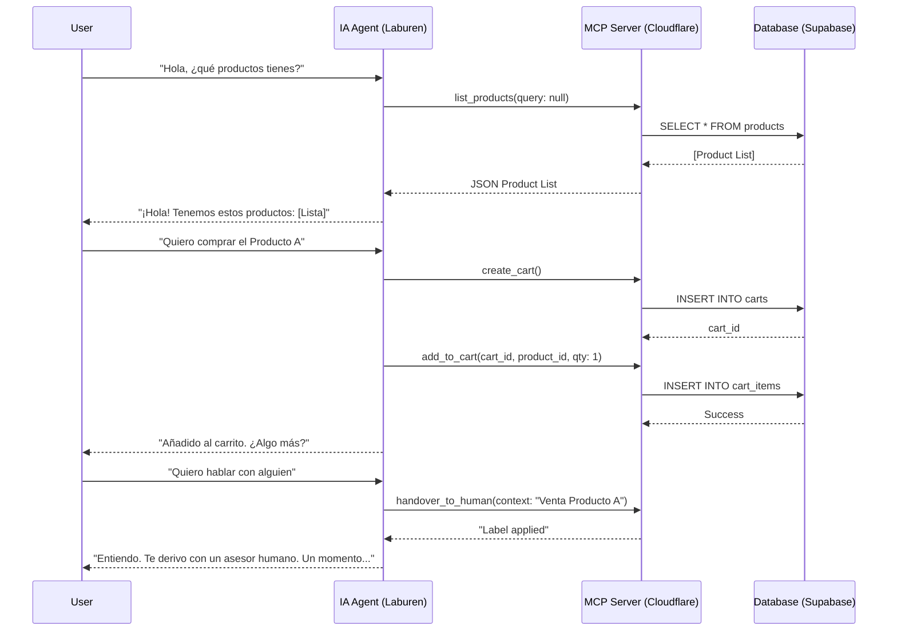

# AI Agent Concept: Product Sales Flow

This document details the interaction flow between the user, the IA Agent (Laburen), and the MCP server (Supabase Backend).

## Interaction Flow (Mermaid)

## MCP Endpoints (Tools)

| Tool | Parameters | Description |
| :--- | :--- | :--- |
| `list_products` | `query?: string` | Searches products by name or description. |
| `get_product_details` | `id: string` | Returns full details of a specific product. |
| `create_cart` | `none` | Creates a new session/cart ID. |
| `add_to_cart` | `cart_id, product_id, qty` | Adds a product to the specified cart. |
| `update_cart` | `cart_id, items[]` | Updates quantities or removes items. |
| `view_cart` | `cart_id` | Fetches all items currently in the cart. |
| `handover_to_human` | `reason: string` | Escalates to Chatwoot and applies tags. |

## Strategy
1. **Intention Detection**: The agent uses the LLM to identify when the user wants to "explore", "buy", or "edit".
2. **Context Management**: The `cart_id` is maintained in the conversation context (metadata) provided by Laburen.
3. **Coherence**: The agent always confirms actions (e.g., "Ya agregué el producto X al carrito").
